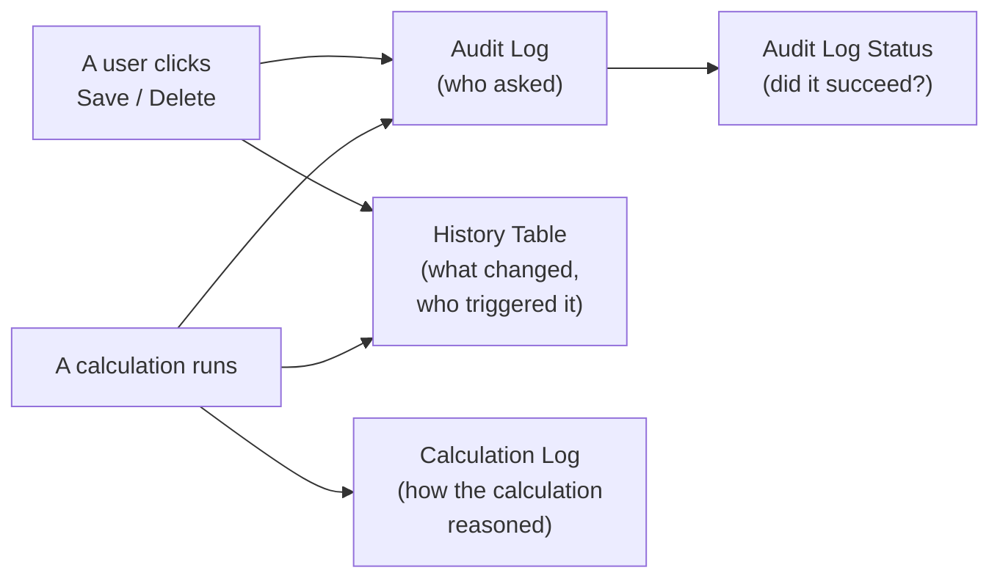
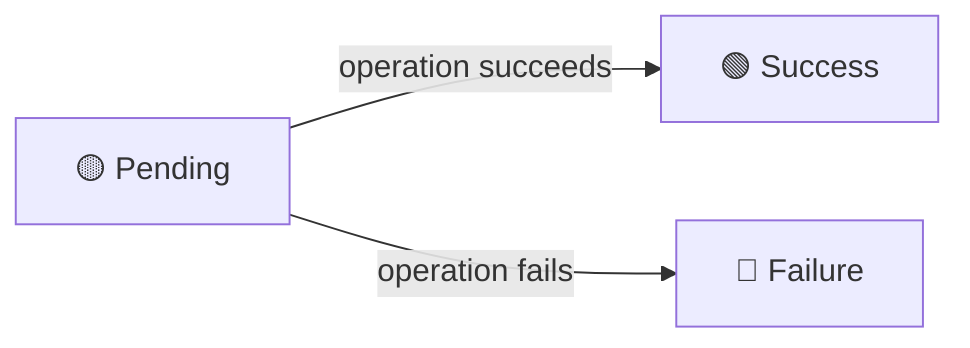
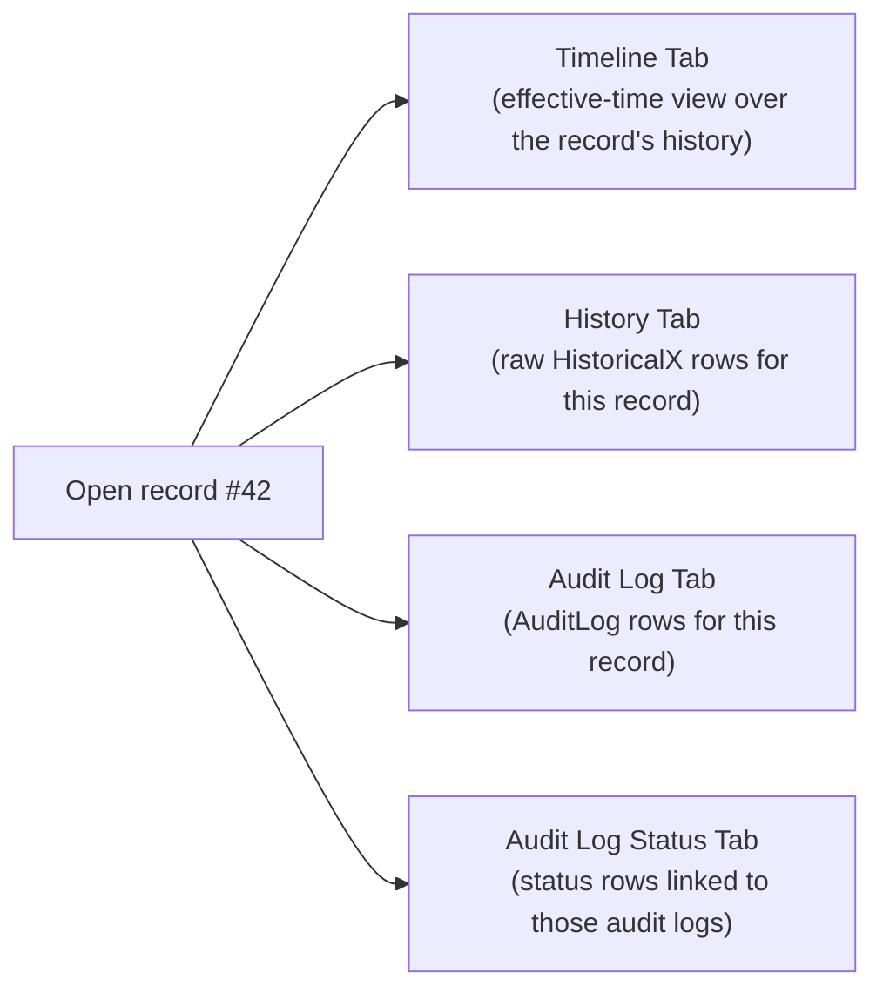

Lex App quietly maintains a small set of "behind-the-scenes" tables that capture _what your application did, when it did it, and who asked for it_. You don't have to write code to populate them — they fill themselves up as people click around the app, run calculations, and edit records.

This page explains, in plain language, what each of these tables is for and how to judge whether the value they provide is worth the storage they consume.

Two kinds of events feed these tables:

- **Edits** — a user (or an external API client) creates, changes, or deletes a record directly.
- **Calculations** — Lex App runs a piece of business logic that may itself create, change, or delete records.

Both kinds of events flow through the same write path, so both produce **History** and **Audit Log** entries — the History row's `history_user` (and the Audit Log's `author`) records _who triggered the change_, regardless of whether it came from an edit or from a calculation. The **Calculation Log** sits one level deeper: it explains the _internal reasoning_ of a calculation run, and it is linked to the History and Audit entries that the calculation produced.

A word on terminology used on this page: we deliberately avoid lumping _edits_ and _calculations_ together under the single word "update". They look identical at the data-write level, but they are different in two important ways: only edits update `edited_by` / `edited_at`, and only calculations produce a Calculation Log.

## The Four Tables at a Glance

| Table                | Answers the Question                                     | Created When                                                                           |
| -------------------- | -------------------------------------------------------- | -------------------------------------------------------------------------------------- |
| **Calculation Log**  | _"What did the calculation do, step by step?"_           | A calculation runs                                                                     |
| **History Tables**   | _"What did this record look like at any point in time?"_ | A record is created, changed, or deleted (by an edit _or_ by a calculation)            |
| **Audit Log**        | _"Who asked for this change, and what did they send?"_   | An API operation is performed (create / change / delete), or a calculation writes data |
| **Audit Log Status** | _"Did that request actually succeed?"_                   | Together with each Audit Log entry, then updated as the operation finishes             |

> [!note]
> The columns `edited_by` and `edited_at` on a record reflect **edits only**. Calculation-driven changes do _not_ update them — even though they do produce History and Audit entries. If you need to know whether a particular change came from a person or from a calculation, look at the Audit Log entry's `calculation_id`.

---

## 1. Calculation Log

### What It Is

Every time a calculation runs, Lex App writes a structured, Markdown-formatted log to the **Calculation Log** table. The log captures whatever the calculation reports about itself — progress messages, headings, tables, DataFrames, JSON snippets, code blocks, and so on — produced through the [[features/processing/logging|LexLogger]] API.

> [!info] Who controls what ends up in each tracking table
> The Calculation Log is the only tracking table whose **content** is shaped by project code. Consultants call into the [[features/processing/logging|LexLogger]] API from inside a calculation to decide what gets logged — which sections, headings, tables, DataFrames, and intermediate values appear.
>
> By contrast, **Audit Log**, **Audit Log Status**, and **History** are filled in automatically by Lex App and cannot be customised from project code. The only fields a consultant can meaningfully override on a record are the standard `created_at` / `created_by` / `edited_at` / `edited_by` columns (for example, when importing data from another system and you want to preserve the original authorship).

Each entry is automatically linked to:

- The **calculation run** that produced it
- The **record** the calculation was operating on
- Its **parent calculation** (if it was triggered by another calculation) (example: a period triggers plans)

### How Users Reach It

Unlike History and Audit data, **Calculation Log** is not exposed as a universal tab on every record detail page. In the current UI, users typically open it in one of these three ways:

- **While a calculation is running** — click the spinning _Calculate_ button on the record. A live dialog opens and streams new log lines in real time as the calculation makes progress.
- **From the Calculation Log entry in the sidebar** — this opens the global Calculation Log table. From any row, the **View Log** and **Download PDF** actions open or export that calculation's log.
- **From the Audit Log** — every audit entry that was produced by a calculation has a non-empty **Calculation Log** column. Clicking it opens the hierarchical log tree for that calculation, so you can see exactly what the calculation did to produce the change recorded in that audit entry.

### Intended Use

- **Show your work.** When a calculation produces a number, the log explains _how_ it got there — which inputs it used, which intermediate values it computed, which branches it took.
- **Live progress.** While a long calculation is running, end users can open the Calculation Log panel and watch progress unfold in real time.
- **Hierarchical visibility.** When a parent calculation triggers child calculations, the log tree mirrors that structure, so reviewers can drill from the top-level result into each sub-step.
- **Exportable evidence.** Any calculation log can be exported as a PDF — useful for compliance files, model validation reviews, or simply emailing a result to a colleague.

### Benefits

- **Trust in the numbers.** Decision-makers can see _why_ a result is what it is, not just the final value.
- **Faster debugging.** When a result looks wrong, the log usually shows exactly where things went off.
- **Self-service auditing.** Business users can answer "how was this computed?" without asking a developer.
- **Regulator-friendly artefacts.** Rich Markdown output (tables, DataFrames) makes the log readable as a standalone document.

### When the Value Is Highest

- Calculations are non-trivial (multiple steps, branching logic, aggregations).
- Results feed into reports, financial figures, or external decisions.
- You operate in a regulated environment where "show your work" is a requirement.

### When the Value Is Lower

- Calculations are trivial passthroughs or simple arithmetic.
- Results are short-lived and not consumed downstream.

---

## 2. History Tables

### What They Are

For every tracked model in your application, Lex App maintains a parallel **History table** (e.g., `Employee` is shadowed by `HistoricalEmployee`). On every create, update, and delete, a _full snapshot_ of the record is appended to the history table.

Each historical row contains:

- **All field values** at that moment (not just the changed ones)
- **`valid_from` / `valid_to`** — the time window during which this version was the current one
- **`history_type`** — created (`+`), changed (`~`), or deleted (`-`)
- **`history_user`** — who triggered the change (the person who edited the record, or the user who launched the calculation that produced this change)
- **`history_change_reason`** — an optional free-text note

> [!note]
> `history_change_reason` is currently only writable from code (for example, from inside a calculation). There is no UI today that lets an end user attach a reason to a change.

> [!note]
> This page only covers the standard, user-visible history layer. Lex App also has an internal second layer used for advanced bitemporal scenarios; it is not exposed in normal user views and is not relevant to evaluating day-to-day value.

### Intended Use

- **Time travel.** Reconstruct exactly what any record looked like at any past moment.
- **Change inspection.** Compare two versions of the same record to see what was changed and by whom.
- **Recovery.** Restore lost or accidentally overwritten values without resorting to backups.
- **Activity reports.** Answer questions like "how many price changes did we make last quarter?" or "which records did this user touch?".

### Benefits

- **Total auditability of data.** Nothing is ever silently overwritten — every prior version is preserved.
- **Built-in undo evidence.** Even after a delete, the last-known state of the record is available.
- **Zero configuration, and no way to bypass it.** History is on by default for every business model; you don't need to opt in or write extra code. As long as history is enabled for a model, the history-writing logic itself cannot be disabled or overridden from project code — every create, change, and delete on that model is captured.
- **Trust during migrations.** When data is reshaped or imported, you can prove the before/after state.

### When the Value Is Highest

- Records change over time and the _previous_ values matter (prices, statuses, ownership, contracts, configurations).
- You face audits, disputes, or regulatory reviews where "show me what this looked like on date X" is a real question.
- Multiple users edit the same data and you need accountability per change.

### When the Value Is Lower

- The model holds purely transient data (uploads, scratch tables, computed staging). For these, history rarely earns its storage cost, so Lex App lets you exclude individual models from tracking via the `untracked_models` setting — useful when a table is internal plumbing that users never interact with directly.

### Cost Considerations

History tables grow with every change. For models edited frequently, the history table can become much larger than the live table over time. This is normal and expected — but it's worth knowing when you size storage and plan retention.

---

## 3. Audit Log

### What It Is

Every API operation that creates, changes, or deletes a record is recorded in the **Audit Log** table. Where the History tables capture _what the data looked like_, the Audit Log captures _the request itself_ — the who, the when, and the exact payload that came in.

The Audit Log is also where **edits and calculations meet in one place**. Every change to a record produces an audit entry, whether it came from a person clicking _Save_ or from a calculation writing to the database. The two cases are easy to tell apart: if the change came from a calculation, the audit entry's `calculation_id` is filled in and links to that calculation's log tree, so you can jump from the audit row directly into the full reasoning behind the change. For plain user edits, `calculation_id` is empty.

Each entry stores:

| Field                        | What It Means                                                                                                                                                                                                                                                                                      |
| ---------------------------- | -------------------------------------------------------------------------------------------------------------------------------------------------------------------------------------------------------------------------------------------------------------------------------------------------- |
| `date`                       | When the request was received                                                                                                                                                                                                                                                                      |
| `author`                     | The user who performed the action (for a calculation-driven change, the user who launched the calculation)                                                                                                                                                                                         |
| `resource`                   | Which model was targeted (e.g., `expense`)                                                                                                                                                                                                                                                         |
| `action`                     | `create`, `change`, or `delete`                                                                                                                                                                                                                                                                    |
| `payload`                    | For creates and updates, this starts as the submitted payload and, on success, is rewritten to the final persisted state. On failure, it remains the attempted payload.                                                                                                                            |
| `content_type` + `object_id` | A pointer back to the affected record, so you can jump from the audit entry to the live record                                                                                                                                                                                                     |
| `calculation_id`             | If the change was triggered by — or executed inside — a calculation, this is the ID of that calculation's log tree. Click it to open the full **Calculation Log** and see exactly what the calculation did to produce this change. Empty for plain user edits made directly through the UI or API. |

> [!note]
> Read `payload` together with **Audit Log Status**. On a successful request, it tells you what was finally persisted. On a failed request, it tells you what was attempted.

### Intended Use

- **Security auditing.** Prove who did what, when, and against which record.
- **Forensics.** When something looks wrong, see the exact payload that was submitted — including fields the user might claim they didn't send.
- **Per-record activity feed.** Each record's detail page shows its own audit log, so you can review the full request history for a single object.
- **Bulk-operation transparency.** Bulk updates and deletes produce one audit entry per affected record, so even mass changes remain individually accountable.
- **From "what was changed" to "why it was changed".** When the `calculation_id` is filled in, the audit entry stops being just a record of a request and becomes the entry point into the full calculation story. One click takes you from _"this field was set to 1,500 by user X"_ to the entire **Calculation Log** tree showing the inputs, the steps, and any nested sub-calculations that led to that number. This is how user-facing accountability and computational transparency are linked together in Lex App.

### Benefits

- **Accountability that survives the data.** Even if a record is later deleted, the audit log preserves who created it, who changed it, and who removed it.
- **Faster incident response.** A complete record of the _request_ (not just the _result_) makes it possible to reconstruct what a user actually did.
- **Compliance ready.** Many frameworks (SOX, GDPR, ISO 27001, internal IT controls) require a "who did what" log. This table is that log.

### When the Value Is Highest

- The application is used by many people, especially across roles and permissions.
- You need to satisfy security, compliance, or internal-control requirements.
- Records are valuable enough that disputes about authorship or intent are realistic.

### When the Value Is Lower

- The system is used by a single trusted operator with no compliance obligations.

---

## 4. Audit Log Status

### What It Is

Every Audit Log entry is paired with an **Audit Log Status** entry that tracks the outcome of the operation. Statuses move through a small lifecycle:

- **Pending** — the audit log was written _before_ the operation executed.
- **Success** — the operation completed; the payload is updated to reflect the final, persisted state.
- **Failure** — the operation failed; the full error traceback is stored alongside the status.

### Intended Use

- **Capture failures, not just successes.** Because the audit log is created _before_ the operation runs, even operations that crash, fail validation, are blocked by permissions, or roll back later in the request can still be recorded with their reason for failure.
- **Distinguish "user tried" from "user did".** The status tells you whether a request actually changed the data, or merely attempted to.
- **Diagnose recurring errors.** Patterns of failed operations (same user, same resource, same error) point to UI bugs, missing permissions, or training gaps.

### Benefits

- **Complete picture.** The Audit Log says _what was attempted_; the Status says _what actually happened_.
- **Security signal.** Repeated `failure` entries — for example, many denied delete attempts — can indicate misconfigured permissions or even malicious probing.
- **Developer feedback.** Stored tracebacks let engineers reproduce and fix issues without needing the user to re-trigger them.

### When the Value Is Highest

- You care about _attempted_ actions, not only successful ones (security, compliance, abuse detection).
- You support many users and want to spot recurring errors centrally.

### When the Value Is Lower

- You only ever review successful changes and treat failures as "someone will retry" — but even then, the status is small and cheap to keep.

---

## How They Work Together

These four tables are designed to overlap intentionally. Each one answers a slightly different question, and together they form a complete picture of the application's behaviour.

| Question                                               | Best Answered By                                                     |
| ------------------------------------------------------ | -------------------------------------------------------------------- |
| _"How did this calculation arrive at this number?"_    | **Calculation Log**                                                  |
| _"What did this record look like last Tuesday?"_       | **History Tables**                                                   |
| _"Who edited this record, and what did they send?"_    | **Audit Log**                                                        |
| _"Did that edit actually go through, or did it fail?"_ | **Audit Log Status**                                                 |
| _"Why did the system reject this user's request?"_     | **Audit Log Status** (traceback)                                     |
| _"Was the previous value of this field correct?"_      | **History Tables** + **Calculation Log** (if the value was computed) |

## Evaluating Their Value for Your Use Case

A simple way to decide how much weight to put on each table:

1. **Do you have to defend your numbers to anyone?** (Auditors, regulators, customers, leadership.)
   - Yes → **Calculation Log** and **History Tables** are high-value.
2. **Do multiple people edit the same data?**
   - Yes → **Audit Log** is high-value.
3. **Do you need to distinguish _attempts_ from _successes_?**
   - Yes → **Audit Log Status** is high-value.
4. **Is "what did this look like before?" a question that ever comes up?**
   - Yes → **History Tables** are high-value.

If the answer to all four is "no", you can safely treat these tables as background insurance — they cost very little and quietly protect you against the day someone asks a question you didn't expect.

---

## Per-Record Views: The Same Tables, Auto-Filtered

In the UI, you reach a record's tracking views by opening its [[interface/record-detail/index|detail page]] — in a list, click the **eye** icon in the _Actions_ column for that row. The detail page exposes the tracking tables as tabs that are already filtered to this single record, so you only see the History, Audit Log, and Audit Log Status entries that belong to it.

Three of the four tracking systems have such a generic per-record view: **History**, **Audit Log**, and **Audit Log Status**. Useful for administrators at the global table level — but much easier for an end user once they are pre-scoped to _one_ record.

**Calculation Log** is exposed a little differently: not as a universal tab on every model, but through calculation-specific fields, live calculation dialogs, and the dedicated calculation-log tree.

To bridge the gap for the other tracking tables, the record page pre-filters the master data down to that single record. No queries to write, no IDs to copy, no joins to remember. You open a record, click a tab, and you see only the slice that belongs to it.

### What You See on the Record

| Tab on the Record                                        | Underlying Table                                           | What's Filtered                                                                         |
| -------------------------------------------------------- | ---------------------------------------------------------- | --------------------------------------------------------------------------------------- |
| **Timeline**                                             | The same history data, served through the history endpoint | A visual effective-time view of this record's versions, including **As-Of** time travel |
| **[[interface/record-detail/history tab\|History]]**     | History table for this model                               | The raw historical rows belonging to this record                                        |
| **[[interface/record-detail/audit log tab\|Audit Log]]** | `audit_logging_auditlog`                                   | The API operations for this record, filtered from the audit payload for this record ID  |
| **Audit Log Status**                                     | `audit_logging_auditlogstatus`                             | The success / failure rows linked to those audit-log entries                            |

Think of **Timeline** and **History** as two views over the same underlying historical data:

- **Timeline** is optimized for questions like _"what was true at time X?"_
- **History** is optimized for raw row inspection, filtering, sorting, and export

> [!note]
> **Calculation Log** does not appear as a generic tab on every record. When a model exposes calculation fields, the Summary view can show a **Calculation Log** button or **View Log / Download PDF** actions instead.

The raw **History**, **Audit Log**, and **Audit Log Status** tabs reuse the same grid shell as the rest of the app: filtering, sorting, saved views, reload, and column controls. The **Timeline** tab is different: it is a purpose-built history view and is where the **As-Of** control lives.

### Why It's Implemented This Way

The tracking tables are designed to be **complete first, then conveniently sliced**. There is exactly _one_ History table per model, _one_ Audit Log table, _one_ Audit Log Status table — they hold every event for every record, forever. The per-record view is just a _filter_ on that single source of truth.

This separation is deliberate, and it's what makes the day-to-day experience trustworthy:

- **One source of truth.** A finding on a record's tab is the same data an auditor would see in the master table. There is no second copy that could drift, no per-record file that could be edited or lost.
- **No extra wiring per model.** Adding a new tracked model automatically gives it the record-level history and audit surfaces. Developers do not build bespoke per-model audit screens.
- **Record context comes first.** In normal use, people discover this information from the record they are already viewing, not by starting from the global audit tables.
- **Smaller slices are easier to reason about.** The record page starts from a narrow, record-specific subset of the master tables instead of forcing users to search the whole audit corpus.

### Intended Use for End Users

The per-record view is the version of the tracking system that _non-technical users_ actually use. It is meant for moments like:

- **"What happened to _this_ record?"** Open the record, look at **Timeline** for the visual story or **History** for the raw rows — no SQL or table names required.
- **"Who last touched _this_ record?"** Open the Audit Log tab — the most recent row tells you the user, the timestamp, and the exact payload they sent.
- **"Did my last save actually go through?"** Open the **Audit Log Status** tab. A `success` row means it landed; a `failure` row means it did not, and the traceback explains why.
- **"Has anyone tried to delete this record?"** Filter the Audit Log tab by `action = delete`, then inspect the corresponding **Audit Log Status** rows to see which attempts succeeded and which failed.
- **"What did this record look like a month ago?"** Use the **As-Of** control on the **Timeline** tab to move the record view back in time without changing any data.
- **"How was this computed?"** If the record exposes a calculation reference, use the **Calculation Log** button or **View Log** action from the Summary area to jump into the calculation log or log tree.

### Benefits of the Auto-Filtered View

- **Zero learning curve.** Users already know how to open a record. The tracking story is just another tab on a page they already use.
- **Context that travels with the data.** Every record carries its own evidence — history, who-did-what, and success/failure — directly attached to it.
- **Faster reviews.** Instead of exporting a master audit log and filtering in Excel, reviewers click the record and see exactly what they need.
- **Self-service compliance.** Business users can answer most "prove it" questions on their own, without involving developers or DBAs.
- **Operational confidence.** Editors can verify their own changes immediately after saving — the **Audit Log Status** tab confirms the outcome, and the **Timeline / History** views confirm the persisted value.

### When the Value Is Highest

- Your users are domain experts, not engineers — they need answers about specific records, not bulk reports.
- Records are individually meaningful (a customer, a contract, a quarter, a transaction) and frequently looked at on their own.
- Reviews and approvals happen one record at a time.

### When the Value Is Lower

- Work is almost entirely batch-oriented and nobody opens individual records.
- Even then, the per-record view costs nothing extra — it's a free byproduct of the master tables already being there.
